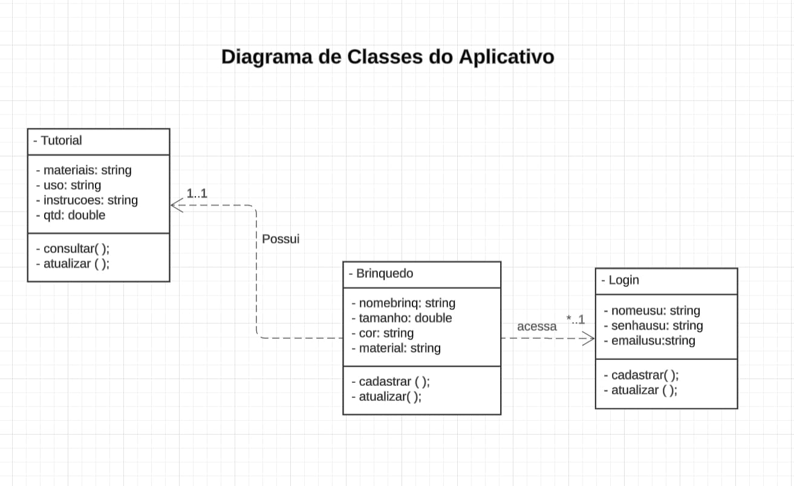

# spidermanapp
#### Ana Beatriz e Giovana Vitória 
## LINK DO VIDEO: https://youtu.be/x7R6P2CjuHs

atualizações e escopo do aplicativo

ESCOPO

• a ideia principal é o homem aranha narrar tutoriais de brinquedos sustentveis feitos a partir de matérias reciclaveis ou que são facilmente encontrados em casa

• atualmente o app possui uma tela inicial, um menu que direciona para 3 dos tutorials já inclusos e uma tela de agardedimento para a

finalização dos tutoriais.

ATUALIZAÇÕES

• o manu possui 4 botões para tutoriais de brinquedos, a ideia e mudar o último botão para ser uma área de favoritos, onde será possivel ver todos os tutoriais que o usuario favoritou.

• para implementar a opção de favoritos, necessario adicionar um formulario de login na tela inicial.

• se possivel depois de adicionar o formulario, um dos planos é adicionar um mecanismo que marca os tutoriais já vistos.

• talvez adicionar uma sessão de como conseguir os matériais para fazer os brinquedos com foco em produtos reciclaveis que tem na

maioria das casas.

• apos realizar o cadastro na tela inicial, uma notificação com a mensagem "gostaria de receber atualizações de novos tutorias por email?" aparecerá na tela

<h2>
ATUALIZAÇÃO DO APLICATIVO COM PERMISSÕES
</h2>

<h3>• Manifesto com as permissões para acessar a localização e câmera(wake_lock e disable_keyguard eram apenas para testes): </h3>

<h2>
ATUALIZAÇÃO DO APLICATIVO COM SENSORES
</h2>

<h3>• Imports dos sensores: </h3>

<h3>• Variaveis:</h3>

<h3>• Acesando e verificando permissão para acessar o acelerometro no manisfesto:</h3>

<h3>• onPause só para economizar processamento onrequestresult verifica se o usuario deu a permissão para abrir a camera:</h3>

<h3>• O calculo da aceleração + calculo do intervalo entre a ultima movimentação e a atul para não abrir a camera toda hora: </h3>

<h3>• Abrir a camera:</h3>

<h3>• Imports:</h3>

<h3>• Variaves: </h3>

<h3>• locationManager para acesar o serviço de localização:</h3>

<h3>• LocationManager para acessar o serviço de localização, onStart para quando a activity for colocada em primerio plano ativar o checargps que pede para ligar a localização:</h3> 

<h3>• checarpermissao verifica se a permissao de loc fine foi concedida no manifesto e pelo usuario, se nao tiver sido ele solicita o acesso a localização, pegarloc faz a mesma coisa mas tbm com a coast loc, location loc pega a localização do usuario e armazena em 2 variaveis(latitude, longitude):</h3>

<h3>• islocationenabled - verifica se algum provedor de localização do dispositivo ta ligado.
  
• locationManager.isProviderEnabled(LocationManager.GPS_PROVIDER): verifica se o provedor de localização GPS ta ligado.

• locationManager.isProviderEnabled(LocationManager.NETWORK_PROVIDER): verifica se o provedor de localização por rede ta ligado.

• abrirMaps abre o google maps com o parametro de pesquisa da latitude e longitude do usuario. O onrequestpermissionsresult é uma resposta para a caixa de dialogo que solicita a permissão de acesso a localização, se for permitido requestcode == request_location_permission todo o processo de pegar loc é feito, senão aparece um aviso:</h3>

<h3>• Coments:</h3>

DIAGRAMA DE CLASSE

